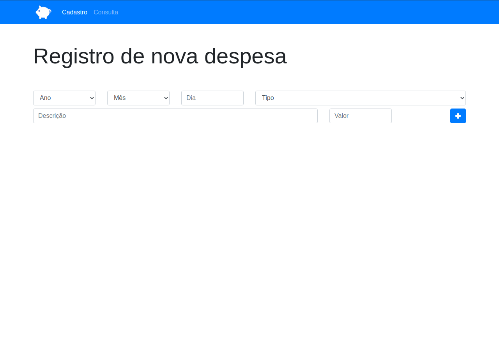
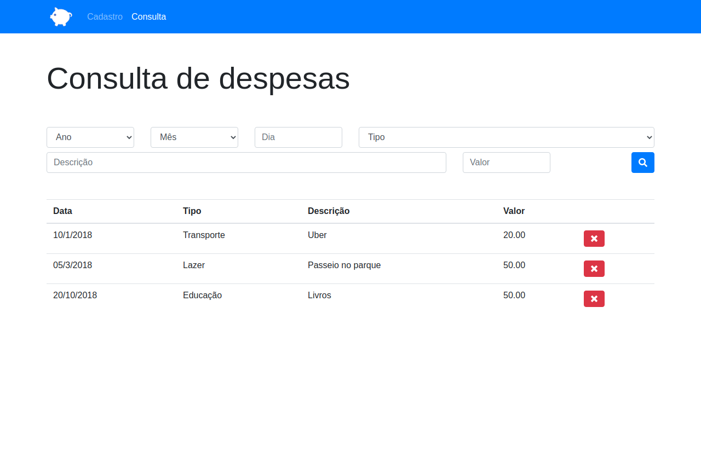

<h1 align="center">
     App Orçamento Pessoal
</h1>

## 📋 Sobre

O projeto **App Orçamento Pessoal** é um app web de registro de despesas desenvolvido dentro do curso de Desenvolvimento Web na Udemy, com o intuito de colocarmos em prática todo conteúdo estudado durante o módulo de JavaScript e POO.  

## 🔧 Tecnologias utilizadas

O projeto foi desenvolvido utilizando as seguintes tecnologias.

- Bootstrap 4

- JavaScript - ECMAScript 6

- JSON 

- Web Storage

### Quer testar o app? Clica aqui 👉 https://lucassilvamarts.github.io/App-Orcamento-Pessoal/index.html

### 📚 Link do curso: https://www.udemy.com/course/web-completo/

<h1>
    
</h1>

 

<h1>
    
</h1>
